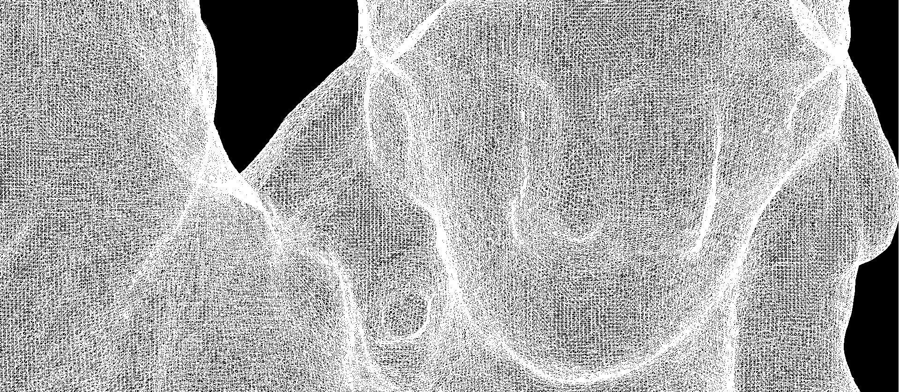

# Practice 3 - Animation



> Youtube Videos:\
> [Animated Test Cube ](https://youtu.be/SqIx80wTwYk)\
> [Animated Statue of Liberty Model, different frames per second](https://youtube.com/playlist?list=PLhJ484eOVwHJFKsMe44BkIr_9PeSRVDlh)

> **Note:** To use the Statue of Liberty model you can download it from [here](https://drive.google.com/file/d/1XV3Lh00eEVkm0UWYZ_MCcxyDjGxeldjo/view?usp=sharing) and place it inside the `sources` directory.

**Usage**\
Compile the source code using `make` and then execute as follows.
```bash
./main <config_file>.oxp
```
The file type given as argument is described below. This directory contains two `.oxp` files (qbe.oxp, model.oxp) ready to use. The ppm files are written in this same directory. To create an animation, excute the MakeAnim.sh shell script file with bash as follows:
```bash
bash MakeAnim.sh <output_file> -[clean]
```
If you want to delete all the ppm files generated once the animation is complete, include as the second argument of the script the option `-clean`, if not, just leave the colon `-`.

## OXP and ASTCK files
This file extension  is a text plain file used to configure the input and the output of the program. It uses a set of defined key-value pairs to set the input and output file, the dimmensions, initial scale, translation and center of projection, and finally if defined, the animation stack to make an AVI video file. This animation stack defines on each line of a plain text file the transformation for each frame given in terms of scale, translation, angle of traslation in the x,y,z axis and the center of this translation. As the program uses a stack structure, the first line of the `.astck` file corresponds to the last animation frame.

> If you are making an animation the key `output` could not be included.

### Example of a `.oxp` file
```
file:test/model.obj
width:1920
height:1080
output:ppm/model.ppm
scale:20000
translate:1.7 -18.5 0 0
center:0.01 0.01 0.02
transformation:test/model.astck
```
### Example of a `.astck` file
```
1.5 1.5 1.5 0 0 0 0.01 0.01 0.01 0 0 0
1.4 1.4 1.4 0 0 0 0.01 0.01 0.01 0 0 0
1.3 1.3 1.3 0 0 0 0.01 0.01 0.01 0 0 0
1.2 1.2 1.2 0 0 0 0.01 0.01 0.01 0 0 0
1.1 1.1 1.1 0 0 0 0.01 0.01 0.01 0 0 0
```